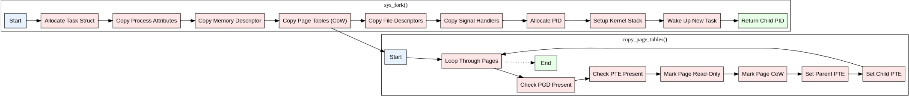
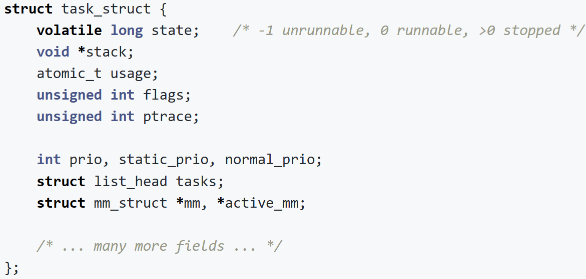

# fork机制
进程创建：
内核作：
    - 内核为子进程创建一个新的 （进程描述符）。task_struct
    - 它复制父级的页 table，但不复制实际的内存页。
    - 子级会收到一个新的 PID 和一个指向其父级的 .task_struct
    - 文件描述符是重复的，其引用计数会增加。
    - 子项的状态最初设置为 直到 fork 完成。TASK_UNINTERRUPTIBLE
要点：
    - 子进程几乎是 fork 时父进程的精确副本。
    - fork()将子级的 PID 返回给父级，将 0 返回给子级，以区分它们的角色。

## 代码简化版本（伪代码）
```cpp
pid_t sys_fork(void) {
    struct task_struct *child;
    child = alloc_task_struct();
    if (!child)
        return -ENOMEM;
    copy_process(child, current);
    child->mm = copy_mm(current);
    copy_page_tables(child);
    copy_files(child, current);
    copy_sighand(child, current);
    alloc_pid(child);
    setup_kernel_stack(child);
    wake_up_new_task(child);
    return child->pid;
}

void copy_page_tables(struct task_struct *child) {
    unsigned long addr;
    for (addr = TASK_SIZE; addr < STACK_TOP; addr += PAGE_SIZE) {
        pgd_t *pgd = pgd_offset(current->mm, addr);
        if (pgd_present(*pgd)) {
            pte_t *pte = pte_offset(pgd, addr);
            if (pte_present(*pte)) {
                pte_t new_pte = *pte;
                pte_make_readonly(new_pte);
                pte_mkspecial(new_pte);
                set_pte(pte, new_pte);
                set_pte(pte_offset(child->mm->pgd, addr), new_pte);
            }
        }
    }
}

```
## Fork 和 COW 机制的可视化
- 

## COW 机制
1.在 fork（） 期间：
    不复制内存页;相反，它们在两个进程中都标记为只读。
    一个特殊标志指示这些页面是 CoW 页面。
2.写入尝试时：
    写入 CoW 页时发生页错误。
    内核的页面错误处理程序：
        分配新的物理页。
        将内容从原始页面复制到新页面。
        更新写入过程的页表以指向新页。
        将新页面标记为可写。
3.内存共享：
    原始页面对于其他进程保持共享和只读状态。
### COW 简化的伪代码

```cpp
int handle_page_fault(struct vm_area_struct *vma, unsigned long address, unsigned int flags) {
    if (flags & FAULT_FLAG_WRITE) { // If it's a write fault
        pte_t *pte = pte_offset(vma->vm_mm->pgd, address);
        if (pte_present(*pte) && pte_special(*pte)) {
            return handle_cow_fault(vma, address, pte);
        }
    }
    return VM_FAULT_SIGBUS; // Return a bus error for other fault types
}

int handle_cow_fault(struct vm_area_struct *vma, unsigned long address, pte_t *pte) {
    struct page *old_page, *new_page;
    old_page = pte_page(*pte);
    new_page = alloc_page(GFP_HIGHUSER_MOVABLE);
    if (!new_page)
        return VM_FAULT_OOM; // Return Out of Memory error if allocation fails
    copy_user_highpage(new_page, old_page, address, vma); // Copy content from the old page to the new
    pte_t entry = mk_pte(new_page, vma->vm_page_prot);
    entry = pte_mkwrite(entry);
    entry = pte_mkyoung(entry);
    entry = pte_mkdirty(entry);
    set_pte_at(vma->vm_mm, address, pte, entry);
    page_remove_rmap(old_page); // Decrease the reference count of the old page
    flush_tlb_page(vma, address);
    return VM_FAULT_WRITE; // Return a write fault indicator
}
```

- 

