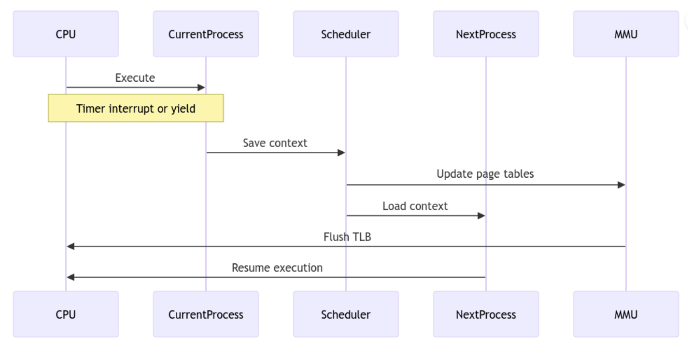

# 上下文切换过程-低级实现细节
- 上下文切换：上下文切换是存储和恢复进程的状态 （上下文） 的过程
## 为什么上下文切换是必要的
- 1.多任务处理：允许多个进程并发运行
- 2.资源共享：实现 CPU 资源的高效利用
- 3.进程隔离：维护安全性和稳定性
- 4.实时响应：确保及时处理高优先级任务
## 涉及的组件
- 1.过程控制块 （PCB）:
    包含进程状态信息
    寄存 器
    程序计数器
    堆栈指针
    内存管理信息
    I/O 状态信息
- 2.CPU 寄存器 :
    通用寄存器
    程序计数器
    堆栈指针
    状态寄存器
- 

### 上下文切换过程的内存管理
```cpp
struct mm_struct {
    pgd_t* pgd;                  // Page Global Directory
    unsigned long start_code;    // Start of code segment
    unsigned long end_code;      // End of code segment
    unsigned long start_data;    // Start of data segment
    unsigned long end_data;      // End of data segment
    unsigned long start_brk;     // Start of heap
    unsigned long brk;           // Current heap end
    unsigned long start_stack;   // Start of stack
};
```