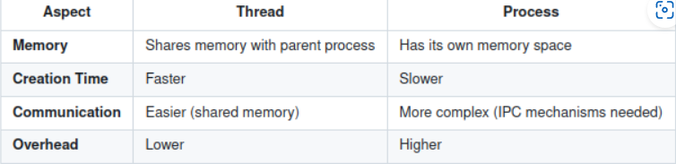

# 线程
- 线程是进程中的最小执行单位。线程共享它们所属进程的相同内存空间和资源，但独立执行。
- 
- 特性：
  - 共享内存：同一进程中的线程共享相同的地址空间，包括全局变量、堆和代码。
  - Independent Execution：每个线程都有自己的 program counters、stack 和 registers。
  - 轻量级：线程比进程更轻量级，因为它们共享资源，并且需要的创建和上下文切换开销更少。

## 线程和进程的区别

- 

## 线程的状态

1.新建：线程已创建但尚未启动。
2.Runnable：线程已准备好运行，但正在等待 CPU 时间。
3.正在运行：线程正在积极执行指令。
4.Blocked/Waiting：线程正在等待资源或事件。
5.Terminated：线程已完成执行。

## 线程状态之间的过渡

- 调用时，线程从 New 转换为 Runnable。pthread_create()
- 当计划程序分配 CPU 时间时，它将变为 Running （正在运行）。
- 在等待 I/O 或同步时进入 Blocked （阻塞）。
- 当它完成执行或显式停止时，它将转换为 Terminated。

## 线程实现模型
### 用户级线程
- 完全在用户空间中进行管理，无需内核参与。
- 优势：
  - 更快的创建和上下文切换。
  - 无内核开销。
- 弊：
  - 无法利用多个 CPU。
  - 阻止系统调用会阻止整个过程。

### 内核级线程
- 由作系统内核管理。
- 优势：
  - 可以在多个 CPU 上运行。
  - 阻止系统调用不会阻止其他线程。
- 弊：
  - 由于内核参与而产生的开销更高。

