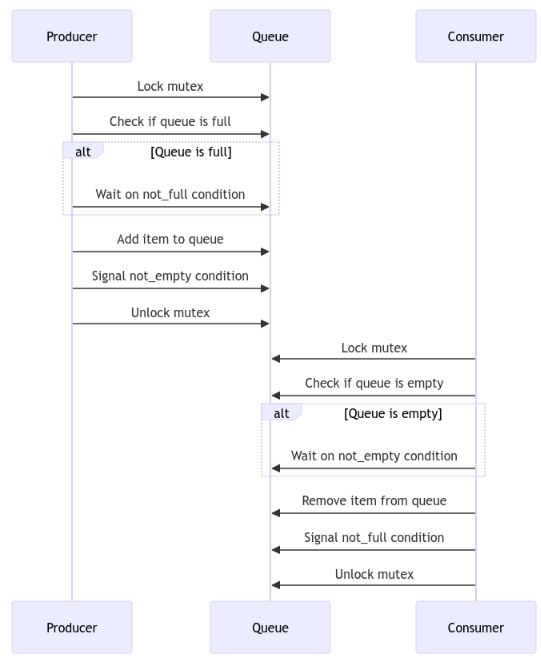

# 线程创建和管理 - POSIX 线程实现

## API 组件
```cpp
#include <pthread.h>

// Core threading functions
int pthread_create(pthread_t *thread, const pthread_attr_t *attr,
                  void *(*start_routine) (void *), void *arg);
int pthread_join(pthread_t thread, void **retval);
int pthread_exit(void *retval);
```
## 生产者消费者模型

- 

```cpp
    // Initialize attributes
    pthread_attr_init(&attr);

    // Set stack size (1MB)
    pthread_attr_setstacksize(&attr, 1024 * 1024);

    // Set detach state
    pthread_attr_setdetachstate(&attr, PTHREAD_CREATE_JOINABLE);

    // Create thread with attributes
    if (pthread_create(&thread, &attr, thread_function, &arg) != 0) {
        perror("Thread creation failed");
        exit(1);
    }

    // Clean up attributes
    pthread_attr_destroy(&attr);

    // Wait for thread completion
    pthread_join(thread, NULL);
```

```cpp
pthread_attr_setdetachstate(&attr, PTHREAD_CREATE_DETACHED); //可以通过设置attr的分离状态来设置线程的分离状态。
```

- 这个里面的attr是一个结构体，里面包含了线程的属性，比如栈大小，分离状态，等等。

```cpp
void* return_value_thread(void* arg) {
    void* result = malloc(sizeof(int));
    *(int*)result = 42;
    return (void*)result;
}

int main() {
    pthread_t thread;
    void* result;

    pthread_create(&thread, NULL, return_value_thread, NULL);
    
    // Wait for thread and get return value
    pthread_join(thread, &result);
    
    printf("Thread returned: %d\n", *(int*)result);
    free(result);

    return 0;
}
```
- 这里面join可以获取线程的返回值。


```cpp
void* cancellable_thread(void* arg) {
    int i = 0;
    while (1) {
        printf("Thread iteration %d\n", ++i);
        sleep(1);
        pthread_testcancel();  // Cancellation point
    }
    return NULL;
}

int main() {
    pthread_t thread;
    
    pthread_create(&thread, NULL, cancellable_thread, NULL);
    sleep(3);  // Let thread run for 3 seconds
    
    printf("Cancelling thread...\n");
    pthread_cancel(thread);
    
    pthread_join(thread, NULL);
    printf("Thread cancelled and joined\n");

    return 0;
}
```

- 设置线程的取消点
- 当线程的取消请求被触发时，线程的取消操作会被推迟到下一个取消点。取消点是在调用线程的执行过程中预定的检查点，线程会在这些检查点处检查是否有取消请求。如果线程收到取消请求，它会在取消点处进行清理，并按照系统要求终止。
- 常见的取消点：
- pthread_testcancel()：这是一个取消点，当线程调用这个函数时，它会检查是否有取消请求。
- sleep()：当线程调用sleep()函数时，它会在sleep()函数返回之前检查是否有取消请求。
- pthread_join()：当一个线程等待另一个线程的结束时，会检查取消请求。
- pthread_cond_wait() 和 pthread_cond_timedwait()：线程在等待条件变量时会检查取消请求。
- pthread_mutex_lock() 和 pthread_mutex_unlock()：线程在获取和释放互斥锁时会检查取消请求。
- read() 和 write()：在执行输入输出操作时，线程也会检查取消请求。

## Barrier

- pthread_barrier_t 是 POSIX 线程库（Pthreads）中用于线程同步的一种工具，称为 屏障（Barrier）。它允许一组线程在某个特定点同步执行，确保所有线程在到达屏障之前都必须等待。当所有线程都到达屏障后，屏障会解除，允许所有线程继续执行。


### 消费生产者模型的初级例子
```cpp
#include <pthread.h>
#include <stdio.h>
#include <stdlib.h>
#include <unistd.h>

#define NUM_THREADS 5
#define QUEUE_SIZE 10

typedef struct {
    int data[QUEUE_SIZE];
    int front;
    int rear;
    pthread_mutex_t mutex;
    pthread_cond_t not_full;
    pthread_cond_t not_empty;
} thread_safe_queue_t;

thread_safe_queue_t queue = {
    .front = 0,
    .rear = 0,
    .mutex = PTHREAD_MUTEX_INITIALIZER,
    .not_full = PTHREAD_COND_INITIALIZER,
    .not_empty = PTHREAD_COND_INITIALIZER
};

void queue_init(thread_safe_queue_t* q) {
    pthread_mutex_init(&q->mutex, NULL);
    pthread_cond_init(&q->not_full, NULL);
    pthread_cond_init(&q->not_empty, NULL);
}


void queue_destroy(thread_safe_queue_t* q) {
    pthread_mutex_destroy(&q->mutex);
    pthread_cond_destroy(&q->not_full);
    pthread_cond_destroy(&q->not_empty);
}

void queue_push(thread_safe_queue_t* q, int value) {
    pthread_mutex_lock(&q->mutex);
    
    while ((q->rear + 1) % QUEUE_SIZE == q->front) {
        pthread_cond_wait(&q->not_full, &q->mutex);
    }
    
    q->data[q->rear] = value;
    q->rear = (q->rear + 1) % QUEUE_SIZE;
    
    pthread_cond_signal(&q->not_empty);
    pthread_mutex_unlock(&q->mutex);
}

int queue_pop(thread_safe_queue_t* q) {
    pthread_mutex_lock(&q->mutex);
    
    while (q->front == q->rear) {
        pthread_cond_wait(&q->not_empty, &q->mutex);
    }
    
    int value = q->data[q->front];
    q->front = (q->front + 1) % QUEUE_SIZE;
    
    pthread_cond_signal(&q->not_full);
    pthread_mutex_unlock(&q->mutex);
    
    return value;
}

void* producer(void* arg) {
    int id = *(int*)arg;
    for (int i = 0; i < 5; i++) {
        int value = id * 100 + i;
        queue_push(&queue, value);
        printf("Producer %d: Pushed %d\n", id, value);
        sleep(1);
    }
    return NULL;
}

void* consumer(void* arg) {
    int id = *(int*)arg;
    for (int i = 0; i < 5; i++) {
        int value = queue_pop(&queue);
        printf("Consumer %d: Popped %d\n", id, value);
        sleep(1);
    }
    return NULL;
}

int main() {
    pthread_t producers[NUM_THREADS];
    pthread_t consumers[NUM_THREADS];
    int thread_ids[NUM_THREADS];
    
    queue_init(&queue);
    
    for (int i = 0; i < NUM_THREADS; i++) {
        thread_ids[i] = i;
        pthread_create(&producers[i], NULL, producer, &thread_ids[i]);
        pthread_create(&consumers[i],
        NULL, consumer, &thread_ids[i]);
    }

    for (int i = 0; i < NUM_THREADS; i++) {
        pthread_join(producers[i], NULL);
        pthread_join(consumers[i], NULL);
    }

    queue_destroy(&queue);

    printf("All threads have finished execution\n");
    return 0;
}
```

- 1.线程安全队列：
    - 循环队列使用互斥锁和条件变量实现，以确保线程安全访问。
    - queue_push将元素添加到队列中，并删除元素。queue_pop
    - 队列使用条件变量来处理队列已满或为空的情况。
- 2.生产者和消费者：
    - 创建者生成数据并将其推送到队列中。
    - 使用者从队列中检索数据并对其进行处理。
    - 生产者和使用者同时运行，展示了同步。
- 3.线程管理：
    - 线程是为生产者和使用者创建的。
    - pthread_join确保主线程等待所有线程完成。